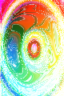

# DCGAN
Personal implementation of the NEAT algorithm.

For more information about NEAT algorithm, you can check [this post](http://blog.otoro.net/2015/07/31/neurogram/) or [this post](https://towardsdatascience.com/neat-an-awesome-approach-to-neuroevolution-3eca5cc7930f).

## Gallery
Here are some generated images

